# Medical Insurance Cost Analysis & Prediction Dashboard

> **DS602 Statistical Modeling Project**  
> An end-to-end analysis of medical insurance charges using exploratory data analysis, hypothesis testing, multiple linear regression, regression diagnostics, model experimentation, and an interactive Streamlit dashboard.

---

## Navigation

[Overview](#project-overview) · [Dataset](#dataset) · [EDA](#exploratory-data-analysis) · [Hypothesis Testing](#hypothesis-testing) · [Regression](#multiple-linear-regression) · [Diagnostics](#regression-diagnostics) · [Log Transformation](#log-transformation-experiment) · [Interaction Model](#bmi--smoker-interaction-experiment) · [Streamlit](#streamlit-dashboard) · [Run Project](#installation-and-running) · [References](#references)

---

# Project Overview

The goal of this project is to study the factors associated with **medical insurance charges** and translate the statistical analysis into an interactive Streamlit application.

The project includes:

- exploratory data analysis,
- descriptive statistics,
- hypothesis testing,
- normality and equal-variance checks,
- multiple linear regression using OLS,
- regression coefficient interpretation,
- residual diagnostics,
- Jarque-Bera and Omnibus normality tests,
- Variance Inflation Factor (VIF),
- an exploratory BMI × smoking interaction model,
- an attempted logarithmic transformation,
- real-time medical-charge prediction,
- 95% confidence and prediction intervals,
- an interactive Streamlit dashboard.

The primary response variable is:

\[
\text{charges}
\]

The primary model retained for the project is:

\[
\text{charges}
\sim
\text{age}
+
\text{sex}
+
\text{bmi}
+
\text{children}
+
\text{smoker}
+
\text{region}
\]

---

# Dataset

The project uses the **Medical Cost Personal Dataset** available on Kaggle.

The dataset contains **1,338 observations** and the following variables:

| Variable | Type | Description |
|---|---|---|
| `age` | Numerical | Age of the insured person |
| `sex` | Categorical | Sex of the insured person |
| `bmi` | Numerical | Body Mass Index |
| `children` | Numerical | Number of dependent children |
| `smoker` | Categorical | Smoking status |
| `region` | Categorical | Residential region |
| `charges` | Numerical | Medical insurance charges |

### Dataset Source

**Kaggle — Medical Cost Personal Dataset**

https://www.kaggle.com/datasets/mirichoi0218/insurance

---

# Project Workflow

The analysis follows this sequence:

```text
Dataset
   ↓
Data Inspection
   ↓
Descriptive Statistics
   ↓
Exploratory Data Analysis
   ↓
Hypothesis Test 1
   ↓
Hypothesis Test 2
   ↓
Multiple Linear Regression
   ↓
Regression Diagnostics
   ↓
VIF
   ↓
Interaction Model Experiment
   ↓
Log Transformation Experiment
   ↓
Interactive Streamlit Dashboard
```

---

# Exploratory Data Analysis

The EDA stage was used to understand the distribution of the variables and identify relationships that should be studied formally.

## 1. Distribution of Medical Charges

This histogram is used to inspect the overall shape of medical insurance charges.

The distribution is strongly right-skewed: many observations occur at lower or moderate charges, while a smaller number of people have very large medical costs.

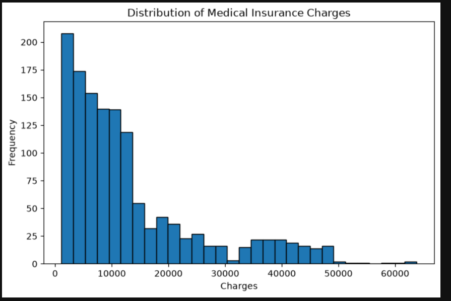

---

## 2. Distribution of BMI

The BMI histogram shows the overall spread of Body Mass Index values in the dataset.

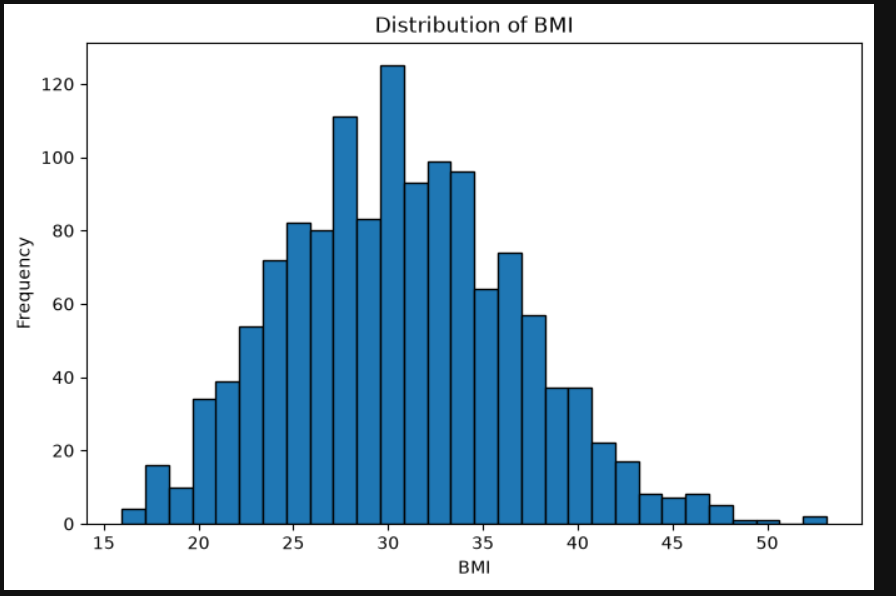

---

## 3. Age vs Medical Charges

This scatterplot investigates whether age contains useful information for predicting medical charges.

A visible upward pattern occurs in part of the data, indicating that charges tend to increase with age. Multiple bands are also visible, suggesting that age alone cannot explain medical charges.

Other variables, particularly smoking status and BMI, are likely contributing to the different groups in the plot.

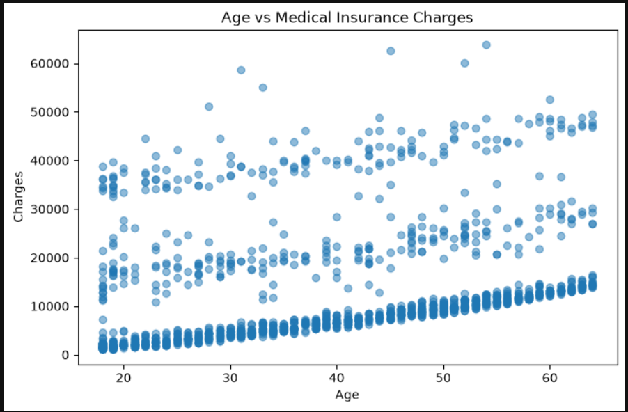

---

## 4. BMI vs Medical Charges

This plot examines the relationship between BMI and medical insurance charges.

The relationship is especially useful when smoking status is considered because the impact of BMI appears to differ substantially between smokers and non-smokers.

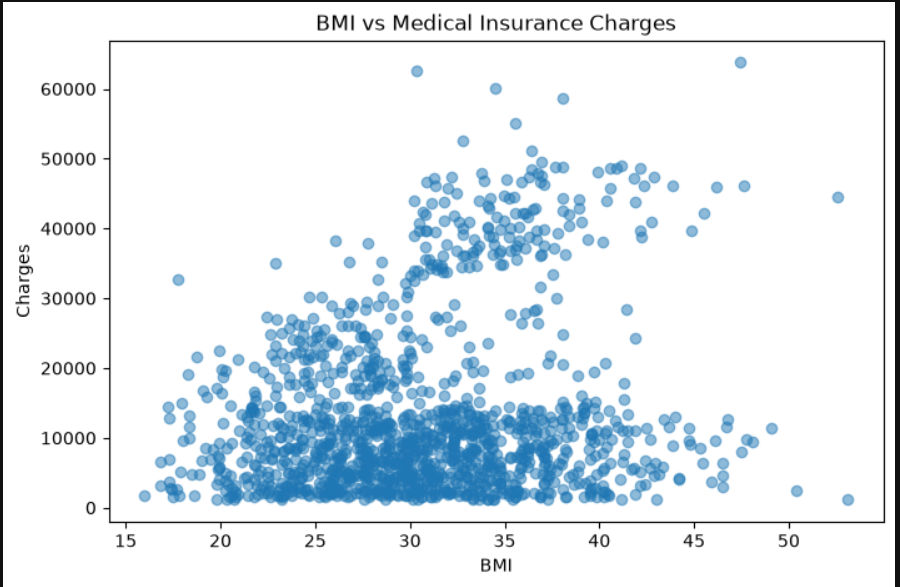

---

## 5. Smokers vs Non-Smokers

A boxplot was used to compare medical-charge distributions for smokers and non-smokers.

The visual difference between these groups motivated the first formal hypothesis test.

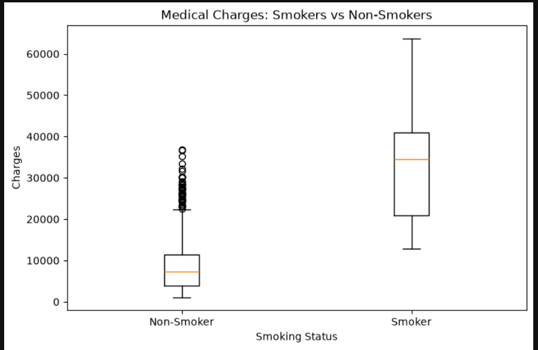

---

## 6. Medical Charges Across Regions

This boxplot compares medical charges across:

- northeast,
- northwest,
- southeast,
- southwest.

The apparent differences were evaluated formally using a multi-group hypothesis test.

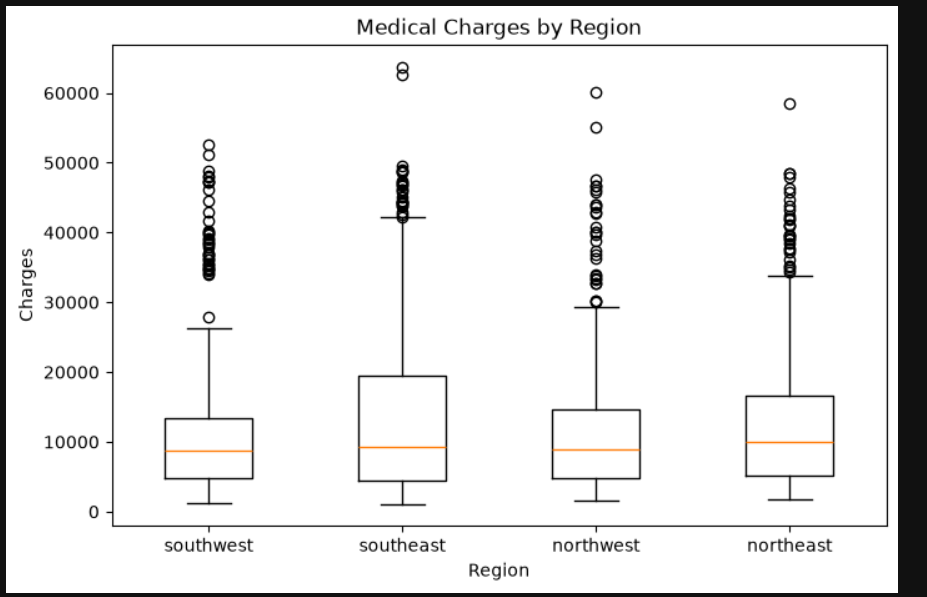

---

# Hypothesis Testing

Two major hypothesis tests were conducted.

The significance level used throughout was:

\[
\alpha = 0.05
\]

---

# Hypothesis Test 1 — Smokers vs Non-Smokers

## Research Question

Do medical-charge distributions differ significantly between smokers and non-smokers?

## Hypotheses

\[
H_0:
\text{Medical-charge distributions do not differ significantly between smokers and non-smokers}
\]

\[
H_1:
\text{Medical-charge distributions differ significantly between smokers and non-smokers}
\]

## Shapiro-Wilk Normality Test

The Shapiro-Wilk test was performed separately for smokers and non-smokers.

| Group | Statistic | p-value | Conclusion |
|---|---:|---:|---|
| Smokers | 0.9396 | \(3.625\times10^{-9}\) | Non-normal |
| Non-Smokers | 0.8729 | \(1.446\times10^{-28}\) | Non-normal |

Both p-values are below 0.05, so the normality assumption was rejected for both groups.

## Levene's Equal-Variance Test

| Statistic | p-value | Conclusion |
|---:|---:|---|
| 332.614 | \(1.559\times10^{-66}\) | Unequal variances |

The equal-variance assumption was also rejected.

## Final Test — Mann-Whitney U

Because normality was not satisfied, the non-parametric Mann-Whitney U test was used.

| U Statistic | p-value |
|---:|---:|
| 284,133 | \(5.270\times10^{-130}\) |

## Final Decision

> **Reject \(H_0\)**

There is extremely strong statistical evidence that the medical-charge distributions of smokers and non-smokers differ.

The Mann-Whitney U test is rank-based, so the safest interpretation is that the **distributions differ significantly** and one group tends to have higher charges than the other.

### Streamlit Hypothesis-Test View

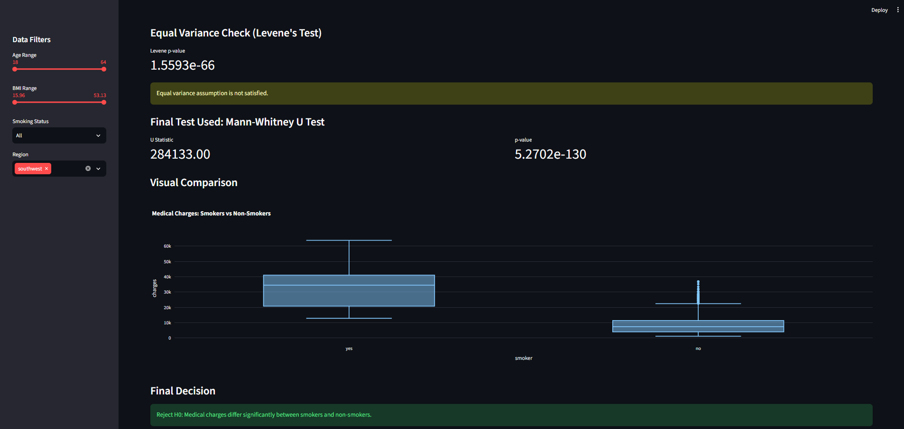

---

# Hypothesis Test 2 — Medical Charges Across Regions

## Research Question

Do medical-charge distributions significantly differ across the four regions?

## Hypotheses

\[
H_0:
\text{Medical-charge distributions do not significantly differ across regions}
\]

\[
H_1:
\text{At least one regional distribution differs significantly}
\]

## Shapiro-Wilk Results

| Region | Statistic | p-value |
|---|---:|---:|
| Northeast | 0.8353 | \(6.552\times10^{-18}\) |
| Northwest | 0.8128 | \(4.269\times10^{-19}\) |
| Southeast | 0.8242 | \(1.233\times10^{-19}\) |
| Southwest | 0.7843 | \(2.024\times10^{-20}\) |

All four groups showed strong evidence of non-normality.

## Levene's Equal-Variance Test

| Statistic | p-value |
|---:|---:|
| 5.560 | 0.000861 |

Since the p-value is below 0.05, the equal-variance assumption was rejected.

## Final Test — Kruskal-Wallis

Because the assumptions for one-way ANOVA were not satisfied, the non-parametric Kruskal-Wallis test was used.

| H Statistic | p-value |
|---:|---:|
| 4.734 | 0.1923 |

## Final Decision

> **Fail to Reject \(H_0\)**

There is not enough statistical evidence to conclude that medical-charge distributions differ significantly across the four regions.

This does **not** prove that all regional distributions are identical. It means the available data did not provide sufficient evidence of a statistically significant regional difference.

### Streamlit Hypothesis-Test View

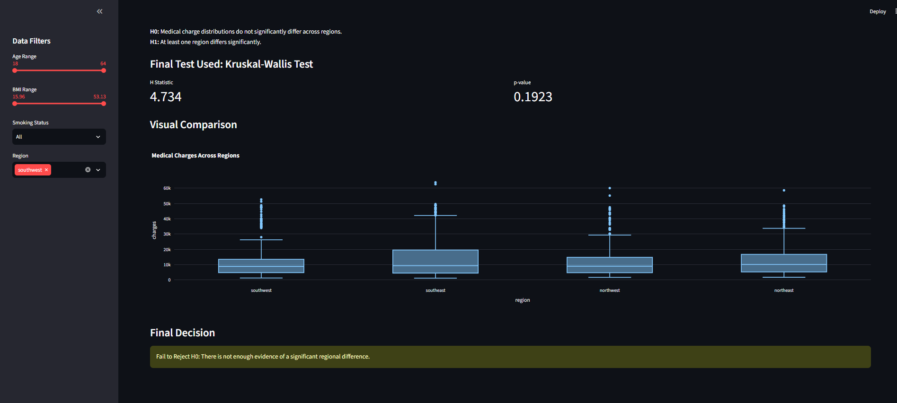

---

# Multiple Linear Regression

The primary OLS model was:

\[
\text{charges}
\sim
\text{age}
+
\text{sex}
+
\text{bmi}
+
\text{children}
+
\text{smoker}
+
\text{region}
\]

The model was fitted using `statsmodels`.

## Model Performance

| Metric | Result |
|---|---:|
| \(R^2\) | 0.751 |
| Adjusted \(R^2\) | 0.749 |
| F-statistic | 500.8 |
| Overall model p-value | < 0.001 |
| Number of observations | 1,338 |

The model explains approximately:

\[
75.1\%
\]

of the observed variation in medical insurance charges.

## Main Coefficient Results

| Predictor | Approx. Coefficient | p-value | Interpretation |
|---|---:|---:|---|
| Age | +256.86 | < 0.001 | Higher age is associated with higher charges |
| BMI | +339.19 | < 0.001 | Higher BMI is associated with higher charges |
| Children | +475.50 | 0.001 | More children are associated with higher charges |
| Smoker = Yes | +23,850 | < 0.001 | Smoking is strongly associated with higher charges |
| Sex = Male | -131.31 | 0.693 | Not statistically significant |

The region coefficients are interpreted relative to the model's reference region.

## Interpretation of Smoking

Holding age, BMI, children, sex, and region constant, smokers were predicted to have approximately:

\[
23,850
\]

higher medical charges than non-smokers.

Smoking status was the strongest predictor in the basic model.

## OLS Regression Output

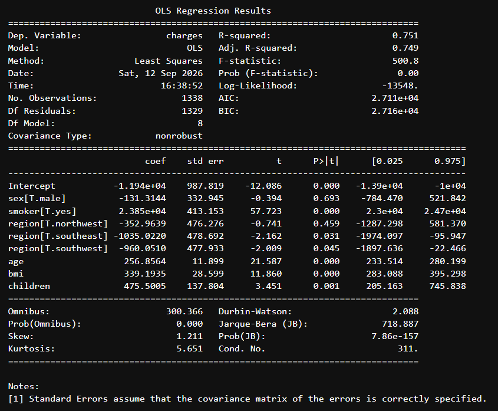

---

# Regression Diagnostics

Regression diagnostics were used to examine whether the assumptions of the fitted OLS model were reasonable.

---

## 1. Residuals vs Fitted Values

For a well-behaved linear regression, residuals should appear randomly distributed around zero with approximately constant spread.

The observed residual plot contains clear bands and systematic patterns rather than random scatter.

This suggests:

- possible non-linearity or missing structure,
- violation of the homoscedasticity assumption.

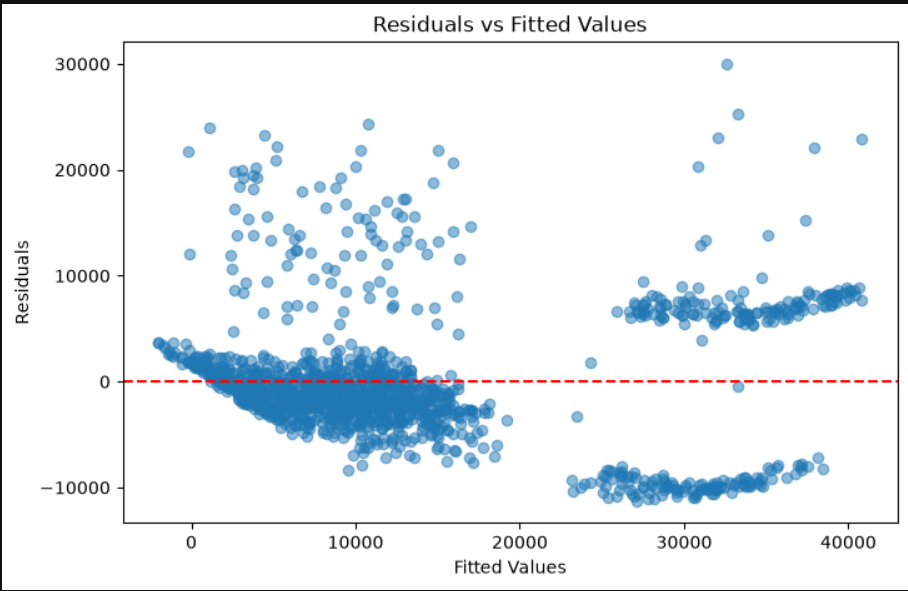

### Conclusion

> **Linearity and homoscedasticity are not fully satisfied.**

---

## 2. Q-Q Plot of Residuals

For normally distributed residuals, the observations should lie reasonably close to the diagonal reference line.

The Q-Q plot shows substantial deviation from the line, especially in the tails.

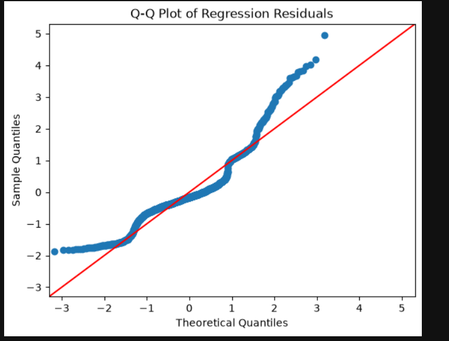

The OLS summary also reported:

| Diagnostic | Result |
|---|---:|
| Omnibus | 300.366 |
| Prob(Omnibus) | 0.000 |
| Jarque-Bera | 718.887 |
| Prob(JB) | \(7.86\times10^{-157}\) |
| Skewness | 1.211 |
| Kurtosis | 5.651 |

Both the Omnibus and Jarque-Bera p-values are far below 0.05.

### Conclusion

> **The residuals are not normally distributed.**

---

## 3. Multicollinearity — VIF

Variance Inflation Factor was calculated for the continuous predictors.

| Predictor | VIF |
|---|---:|
| Age | 1.014 |
| BMI | 1.012 |
| Children | 1.002 |

All values are close to 1 and far below a common concern threshold of 5.

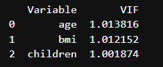

### Conclusion

> **No meaningful multicollinearity was detected among the continuous predictors.**

---

# Log Transformation Experiment

Because the medical-charge distribution and the OLS residuals showed strong skewness, a logarithmic transformation was investigated.

The transformed response was:

\[
\text{log\_charges}=\ln(\text{charges})
\]

An exploratory model including the BMI × smoking interaction was then fitted:

\[
\text{log\_charges}
\sim
\text{age}
+
\text{sex}
+
\text{bmi}
+
\text{children}
+
\text{smoker}
+
\text{region}
+
(\text{bmi}\times\text{smoker})
\]

## Log-Model Results

| Metric | Result |
|---|---:|
| \(R^2\) | 0.784 |
| Adjusted \(R^2\) | 0.782 |
| Residual skewness | 1.846 |
| Residual kurtosis | 7.994 |
| Prob(Omnibus) | 0.000 |
| Prob(JB) | 0.000 |

The transformation reduced some skewness, but it did **not solve the regression-diagnostic problems**.

## Residuals vs Fitted — Log Model

The residual plot still shows strong systematic patterns rather than random scatter.

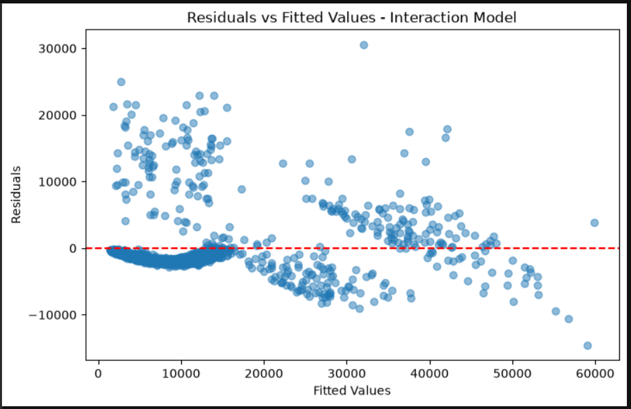

## Q-Q Plot — Log Model

The Q-Q plot still shows substantial departure from the normal reference line.

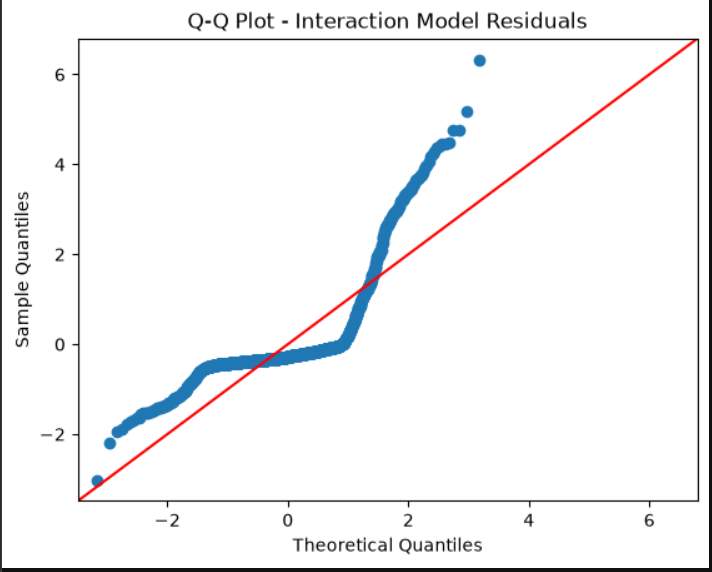

## Decision

> **The logarithmic transformation was not retained as the final solution.**

Although it changed the response scale and reduced some skewness, it did not adequately resolve the residual structure or residual normality issues.

The project therefore reports this attempted transformation transparently rather than repeatedly transforming the model merely to make the diagnostic plots look better.

---

# BMI × Smoker Interaction Experiment

An additional model was investigated using the interaction:

\[
BMI\times Smoker
\]

The model was:

\[
\text{charges}
\sim
\text{age}
+
\text{sex}
+
\text{bmi}
+
\text{children}
+
\text{smoker}
+
\text{region}
+
(\text{bmi}\times\text{smoker})
\]

The interaction term was highly significant:

\[
\beta_{\text{BMI}\times\text{smoker}}
\approx
1443.10
\]

with:

\[
p<0.001
\]

This suggests that the relationship between BMI and medical charges differs substantially according to smoking status.

## Model Fit Improvement

| Model | \(R^2\) | Adjusted \(R^2\) |
|---|---:|---:|
| Basic Multiple Regression | 0.751 | 0.749 |
| BMI × Smoker Interaction Model | 0.841 | 0.840 |

The interaction model improved explanatory power considerably.

However, residual diagnostics still showed assumption violations.

For clarity and straightforward interpretation, the basic multiple regression was retained as the project's **primary model**, while the interaction model is reported as an important exploratory extension.

---

# Model Comparison

| Model | Response Scale | \(R^2\) | Adjusted \(R^2\) | Main Result |
|---|---|---:|---:|---|
| Primary OLS | Raw charges | 0.751 | 0.749 | Main interpretable model |
| BMI × Smoker Interaction | Raw charges | 0.841 | 0.840 | Strong interaction and improved fit |
| Log Interaction Model | Log charges | 0.784 | 0.782 | Did not resolve diagnostics |

> **Note:** \(R^2\) for a model using `log_charges` should not be treated as directly comparable to \(R^2\) from models using raw `charges`, because the response scales are different.

---

# Streamlit Dashboard

The final application contains three interactive tabs.

---

## Tab 1 — Data Exploration

The Data Exploration tab includes:

- age filtering,
- BMI filtering,
- smoking-status filtering,
- region filtering,
- dataset preview,
- descriptive statistics,
- summary metrics,
- charges histogram,
- BMI histogram,
- age vs charges scatterplot,
- BMI vs charges scatterplot,
- smoker boxplot,
- regional boxplot,
- correlation analysis.

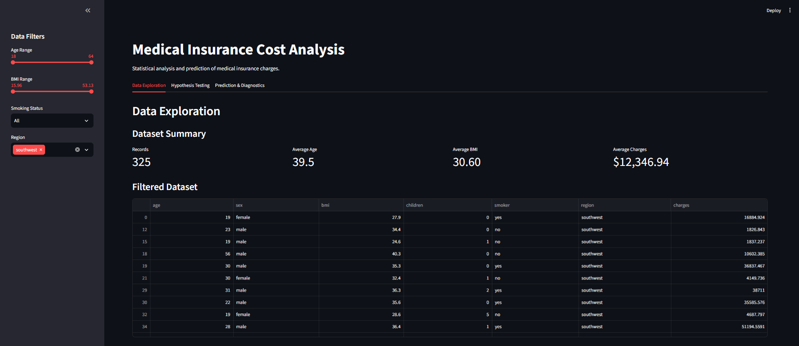

---

## Tab 2 — Hypothesis Testing Lab

The Hypothesis Testing tab allows users to switch between:

1. **Smokers vs Non-Smokers**
2. **Medical Charges Across Regions**

For each analysis, the application displays:

- \(H_0\),
- \(H_1\),
- statistical test results,
- test statistic,
- p-value,
- visual comparison,
- automatic Reject / Fail-to-Reject conclusion.

### Smoker Hypothesis Test


### Regional Hypothesis Test


---

## Tab 3 — Prediction & Diagnostics

The prediction tab accepts user inputs for:

- age,
- BMI,
- number of children,
- sex,
- smoking status,
- region.

The application returns:

- predicted medical charge,
- 95% confidence interval,
- 95% prediction interval,
- regression coefficients,
- residual-vs-fitted plot,
- Q-Q plot,
- Jarque-Bera test,
- Omnibus test,
- VIF table.

### Live Prediction

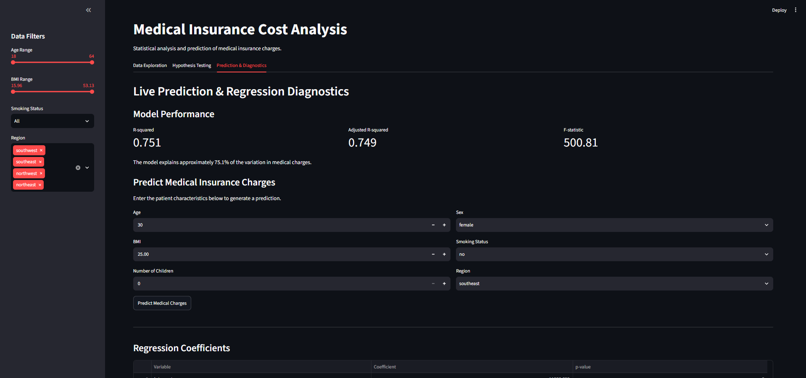

### Live Diagnostic Checks

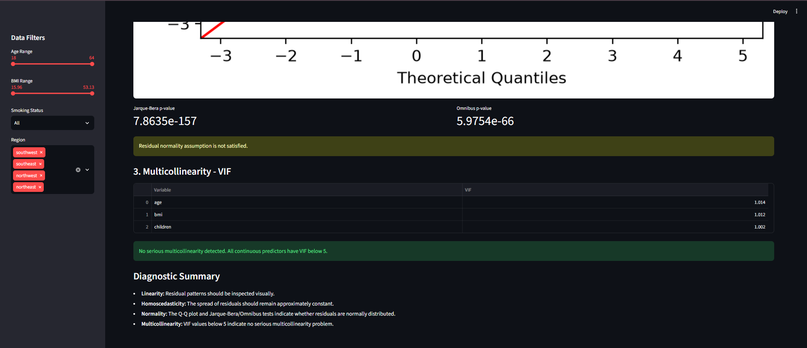

---

# Deployed Application

Once the Streamlit app is deployed, replace the placeholder below with the real application link:

```text
ADD_YOUR_STREAMLIT_APP_URL_HERE
```

Example:

```text
https://202618066ds602medicalcostanalysis-td4j5kqyb9q6dvazxwvdje.streamlit.app/
```

---

# Project Structure

```text
202618066_DS602/
│
├── app.py
├── README.md
├── requirements.txt
├── analysis.ipynb
│
├── Data/
│   └── insurance.csv
│
└── screenshots/
    │
    ├── diagnostics/
    │   ├── 01_residuals_vs_fitted.png
    │   ├── 02_qq_plot.png
    │   └── 03_vif.png
    │
    ├── eda/
    │   ├── 01_charges_distribution.png.png
    │   ├── 02_bmi_distribution.png.png
    │   ├── 03_age_vs_charges.png
    │   ├── 04_bmi_vs_charges.png
    │   ├── 05_smoker_boxplot.png
    │   └── 06_region_boxplot.png
    │
    ├── log_model/
    │   ├── 01_log_residuals.png
    │   └── 02_log_qq_plot.png
    │
    ├── regression/
    │   └── 01_ols_summary.png
    │
    └── streamlit/
        ├── 01_data_exploration.png
        ├── 02_hypothesis_smoker.png
        ├── 03_hypothesis_region.png
        ├── 04_prediction.png
        └── 05_diagnostics.png
```

---

# Installation and Running

## 1. Clone or Download the Repository

Move into the project directory:

```bash
cd 202618066_DS602
```

## 2. Create a Virtual Environment

```bash
python -m venv venv
```

### Windows PowerShell

```powershell
.\venv\Scripts\Activate.ps1
```

If PowerShell blocks activation for the current terminal session:

```powershell
Set-ExecutionPolicy -Scope Process -ExecutionPolicy Bypass
```

Then activate again:

```powershell
.\venv\Scripts\Activate.ps1
```

## 3. Install Dependencies

```bash
python -m pip install -r requirements.txt
```

## 4. Run the Streamlit Application

```bash
python -m streamlit run app.py
```

The application normally opens at:

```text
http://localhost:8501
```

---

# Requirements

The project uses:

```text
pandas
streamlit
plotly
scipy
matplotlib
statsmodels
```

These packages are listed in `requirements.txt`.

---

# Main Conclusions

1. **Smoking status has a very strong relationship with medical charges.**  
   The Mann-Whitney U test produced \(p\approx5.27\times10^{-130}\), so the smoker/non-smoker null hypothesis was rejected.

2. **There was insufficient evidence of an overall regional difference.**  
   The Kruskal-Wallis test gave \(p=0.1923\), so the regional null hypothesis was not rejected.

3. **The primary OLS regression explained 75.1% of the variation in medical charges.**

4. **Age, BMI, number of children, and smoking status were statistically significant predictors in the primary model.**

5. **Smoking status was the strongest predictor in the basic regression model.**

6. **No serious multicollinearity was detected** among the continuous predictors because all VIF values were close to 1.

7. **The OLS diagnostic assumptions were not fully satisfied.**  
   The residual-vs-fitted plot showed clear structure and non-constant spread, while the Q-Q plot, Jarque-Bera test, and Omnibus test showed non-normal residuals.

8. **The logarithmic transformation did not adequately solve the residual problems.**

9. **BMI × smoking status is an important interaction.**  
   Adding the interaction increased the raw-charge model \(R^2\) from 0.751 to 0.841.

10. **A better model fit does not automatically mean that all statistical assumptions are satisfied.**

---

# Limitations

- The dataset is observational, so the analysis identifies associations rather than causal effects.
- Medical charges may depend on additional variables not included in the dataset.
- The primary OLS model violates some classical regression assumptions.
- High predictive performance should not be confused with perfect statistical specification.
- The model should be used cautiously for observations very different from those represented in the dataset.
- Statistical significance does not automatically imply practical or clinical significance.

---

# References

1. **Medical Cost Personal Dataset — Kaggle**  
   https://www.kaggle.com/datasets/mirichoi0218/insurance

2. **SciPy Statistical Functions Documentation**  
   https://docs.scipy.org/doc/scipy/reference/stats.html

3. **Statsmodels Regression Documentation**  
   https://www.statsmodels.org/stable/regression.html

4. **Statsmodels Regression Diagnostics**  
   https://www.statsmodels.org/stable/examples/index.html

5. **Streamlit Documentation**  
   https://docs.streamlit.io/

6. **Plotly Python Documentation**  
   https://plotly.com/python/

7. **Pandas Documentation**  
   https://pandas.pydata.org/docs/

8. Course assignment brief: **LAB 04 — Applied Statistical Modeling & Interactive Web Dashboard**.

---

# Author

**Student ID:** `202618066`  
**Course:** `DS602`  
**Project:** Medical Insurance Cost Analysis & Prediction Dashboard
